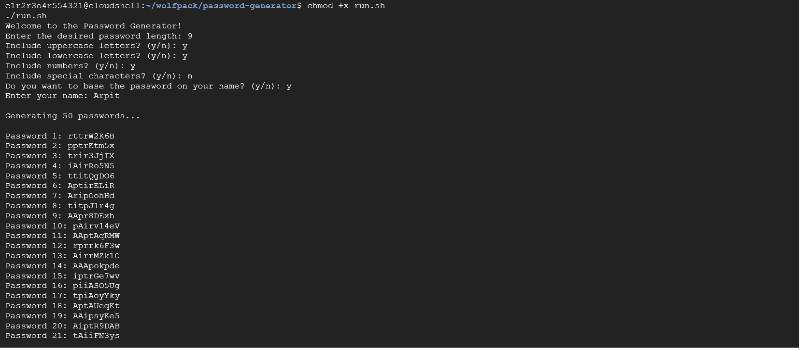

# Password Generator

A Python-based **Password Generator** tool that can create random passwords with customizable settings. Users can also generate passwords partially based on their name for a personal touch.

### 0UTPUT



## Features
- Generate 50 random passwords at a time.
- Customize password length and character types:
  - Uppercase letters
  - Lowercase letters
  - Numbers
  - Special characters
- Option to include a name in the generated passwords.

---

## How to Use

### Prerequisites
- Python 3.x installed on your system.
- A terminal or command-line interface.
- (For Linux/macOS users) Bash shell.

## Steps to Run the Project

### For Linux

1. Clone the Repository 
   ```bash
   git clone https://github.com/GET-UNKNOWN-ERR0R/password-generator.git
   cd password-generator
2. Make script executable:
   ```bash
   chmod +x run.sh
   ./run.sh
### Manually 

1. Clone the Repository 
   ```bash
   git clone https://github.com/GET-UNKNOWN-ERR0R/password-generator.git
   cd password-generator

2.Firstly,Ensure that Python3 is installed on your system if not then install it
  ```bash
   python3 passwd-generator.py
  ```
### License

   
